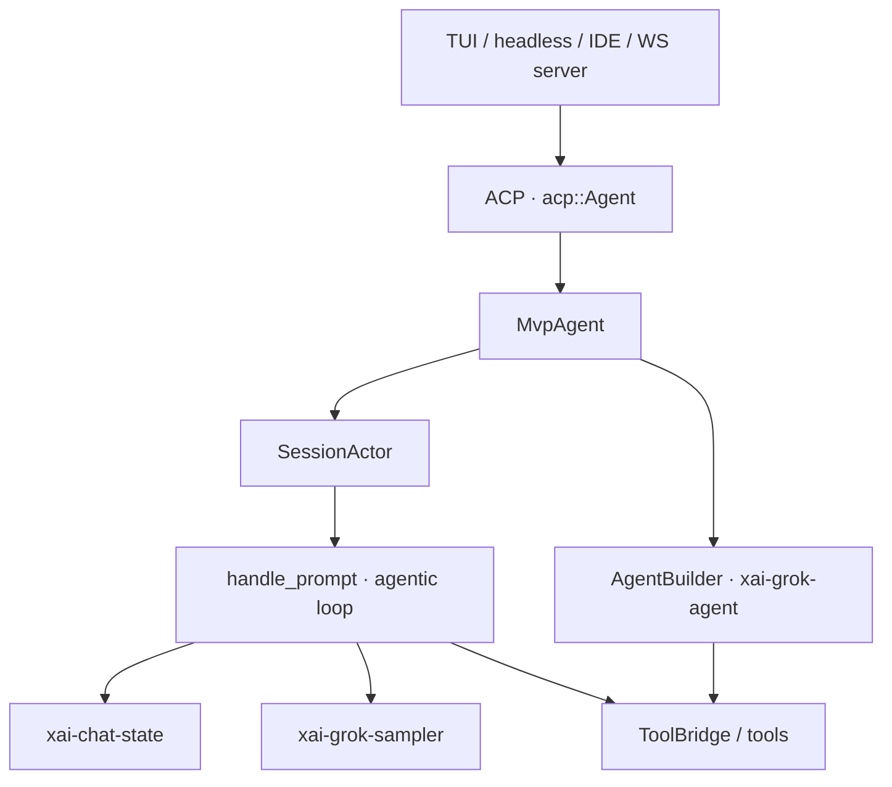
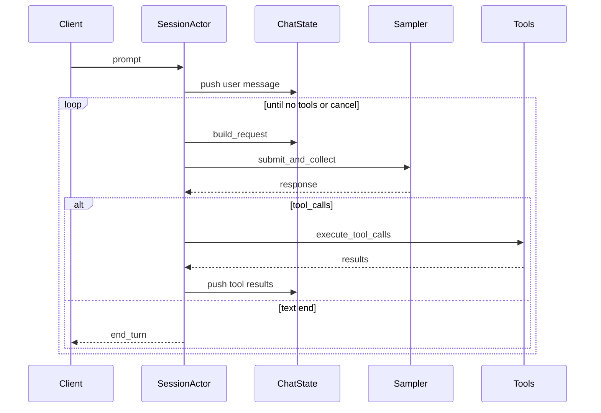

# Agent & harness core design

> Learning-oriented map of this codebase’s **coding agent harness**.  
> Full narrative (Chinese, more diagrams): **[agent-harness.zh-CN.md](agent-harness.zh-CN.md)**.  
> Telemetry: [telemetry.md](telemetry.md).

---

## One-liner

**Harness** = session lifecycle + tool execution + model sampling + permissions/extensions.  
**Agent** = session-bound package of system prompt + toolset + policies.  
The model never mutates the world directly; tools do, and results re-enter **chat state** for the next sample.

---

## Layer map

| Piece | Crate | Role |
|-------|-------|------|
| Entry | `xai-grok-pager-bin` | CLI dispatch |
| UI | `xai-grok-pager` | TUI + ACP client glue |
| Harness | `xai-grok-shell` | SessionActor, MCP, hooks, goal, persistence |
| Agent config | `xai-grok-agent` | Definition → built `Agent` |
| Tools | `xai-grok-tools`, `xai-tool-runtime` | Registry + implementations |
| Conversation | `xai-chat-state` | Actor-owned message list + `build_request` |
| Sampling | `xai-grok-sampler` | Streaming HTTP, retry, cancel |
| Protocol | ACP + `xai-tool-protocol` | Stable cross-boundary shapes |

---

## End-to-end turn

Distinguish:

- **Turn / prompt** — one user (or synthetic) submission, one `prompt_id`.  
- **Loop index** — sample→tools→sample iterations *inside* that turn.

---

## SessionActor event loop

`run_session` multiplexes (simplified): idle/dream timers, model-switch watch, chat-state events, streaming `SessionEvent`s + replay flush, **prompt completion** channel, and **command** channel (`Prompt`, `Cancel`, …).

Turns run on `spawn_local` tasks; the actor loop only joins results. That keeps sampling off the select hot path and preserves single-threaded session ordering.

---

## Agentic inner loop (essentials)

Per loop iteration:

1. Inject interjections / skill & monitor reminders / first-turn memory.  
2. Optional auto-compact before sampling.  
3. Resolve tool specs (incl. `StructuredOutput` shim or native `json_schema`).  
4. `build_request` → `run_turn_via_sampler`.  
5. On tools: prepare (permission, plan-mode, hooks) → `WorkspaceOps::call_tool` → write results back.  
6. Same-path file edits are **serialized**; other tools may run concurrent.  
7. Recoveries: compact-and-resubmit, auth refresh + backoff, max-turns.

Sampler is layered: raw client → stream events → actor handle (retry/cancel/metrics).

---

## Agent as config object

`AgentDefinition` → `AgentBuilder` → session `Agent` (`system_prompt` + `ToolBridge` + policies + optional hosted tools).  
Definitions are portable; built Agents are **not** (bound to session resources).  
Prompt cwd can differ from real execution cwd (worktree/fork hygiene).

---

## Why the design is strong

1. **One harness, many surfaces** via ACP.  
2. **Actor-split truth sources** (session / chat / sampler).  
3. **Tools are the only side-effect channel**, with permission and path locking.  
4. **API heterogeneity** absorbed (backends, hosted tools, StructuredOutput).  
5. **Lifecycle hooks** for skills/hooks/goal/memory instead of ad-hoc branches.  
6. **Cancel-safe tool bridge**, fail-closed usage when subagents lag.  
7. **Streaming UX** with replay buffering and stream-drain barriers.

---

## Suggested reading order

1. This doc + Chinese full version  
2. `session/acp_session_impl/turn.rs` (`handle_prompt`, agentic `loop`)  
3. `sampler_turn.rs`, `tool_dispatch.rs`  
4. `xai-chat-state` lib header  
5. `xai-grok-sampler` lib header  
6. `xai-grok-tools` `bridge.rs` + one `grok_build` tool  
7. `mvp_agent/acp_agent.rs` + `run_loop.rs`

---

## Path index

| Topic | Location |
|-------|----------|
| Entry | `xai-grok-pager-bin/src/main.rs` |
| ACP agent | `shell/.../mvp_agent/acp_agent.rs` |
| Session loop | `shell/.../run_loop.rs` |
| Turn loop | `shell/.../turn.rs` |
| Sampler glue | `shell/.../sampler_turn.rs` |
| Tool dispatch | `shell/.../tool_dispatch.rs` |
| Agent build | `xai-grok-agent/src/builder.rs` |
| Chat state | `xai-chat-state/src/lib.rs` |
| Sampler | `xai-grok-sampler/src/lib.rs` |
| Tool bridge | `xai-grok-tools/src/bridge.rs` |
