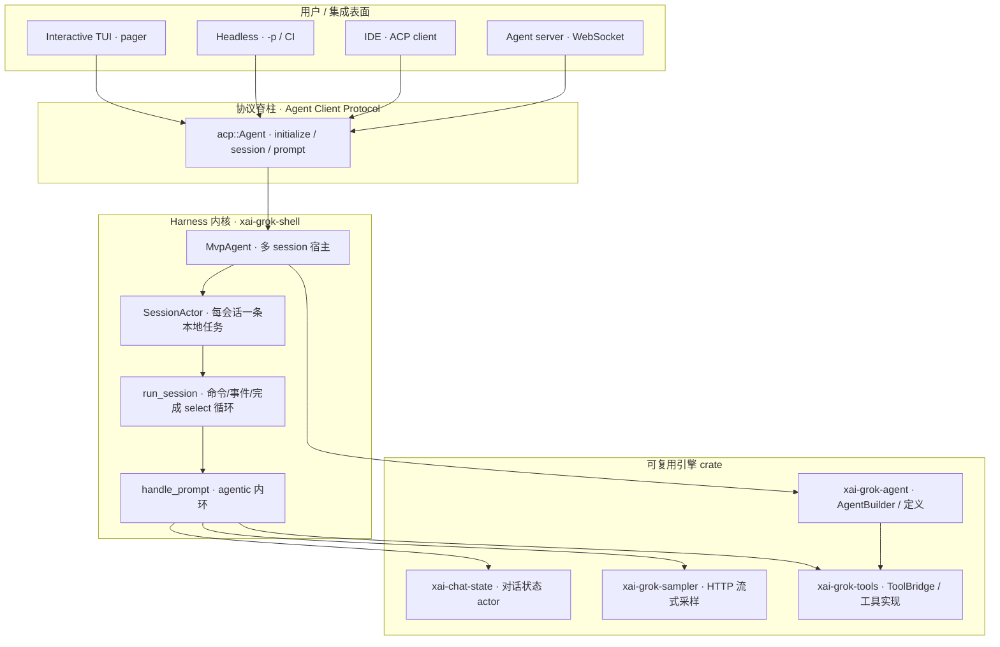
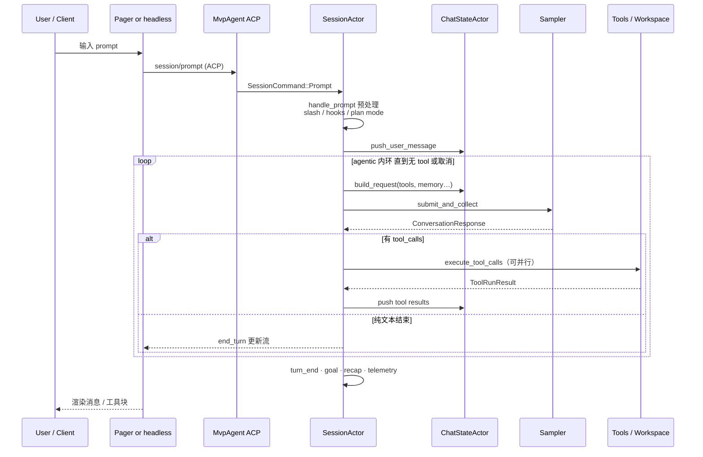
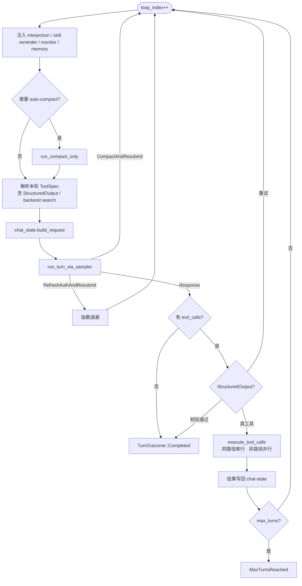
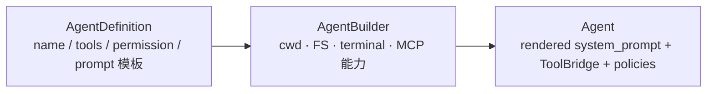
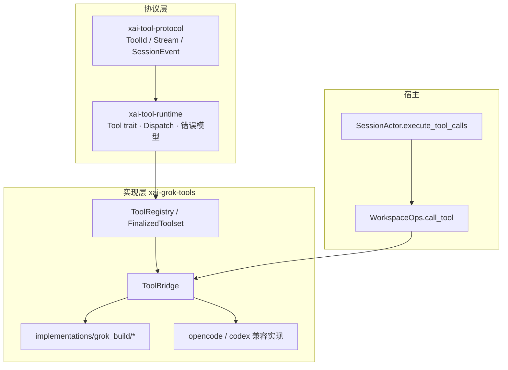
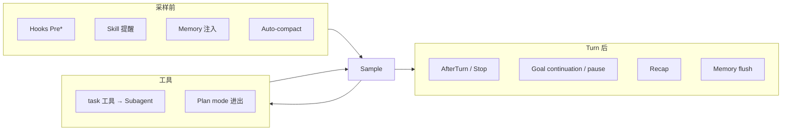

# Agent 与 Harness 核心设计

> 面向想从本仓库学习 **coding agent / harness** 设计的读者。  
> 目标：抓住主路径与关键机制，理解「优秀之处」，而不是罗列全部文件。
>
> 英文摘要：[agent-harness.md](agent-harness.md)  
> 遥测专篇：[telemetry.zh-CN.md](telemetry.zh-CN.md)

| 项 | 值 |
|----|-----|
| 产品形态 | 终端 AI coding agent（TUI / headless / ACP） |
| 本 fork 命令 | `grok-cli`（官方为 `grok`） |
| 文档范围 | 上游开源树的 harness 架构（当前 `main`） |

---

## 1. 先建立心智模型

### 1.1 一句话

**Harness = 会话生命周期 + 工具执行 + 模型采样 + 权限/扩展的宿主；  
Agent = 某次会话上「prompt + tools + 策略」的可执行配置。**

模型不「直接」改仓库：它只产出 text / tool_calls；真正改世界的是 harness 调度的工具，并在每一步把结果写回 **对话状态**，再决定是否继续采样。

### 1.2 三层表面 × 一条协议脊柱



**设计要点：** 交互表面可替换，**会话内核与工具/采样契约不变**。TUI 只是最重的 ACP client；`grok agent stdio` 与 headless 走同一套 `SessionActor`。

### 1.3 仓库里「谁管什么」

| 层级 | Crate / 模块 | 职责一句话 |
|------|----------------|------------|
| 二进制入口 | `xai-grok-pager-bin` | 解析 CLI，分发 TUI / headless / agent / update |
| TUI 渲染 | `xai-grok-pager` | 全屏 UI、与 shell 的 ACP/client 胶水 |
| Harness | `xai-grok-shell` | SessionActor、权限会话、MCP、hooks、goal、持久化 |
| Agent 配置物 | `xai-grok-agent` | 从定义构建 system prompt + toolset + 策略 |
| 工具世界 | `xai-grok-tools` + `xai-tool-runtime` | 工具 trait、注册表、bash/read/edit… |
| 对话状态 | `xai-chat-state` | 无锁 actor：消息列表、`build_request`、usage |
| 采样 | `xai-grok-sampler` | 流式 HTTP、重试、取消、doom-loop 信号 |
| Workspace | `xai-grok-workspace` | 权限、trust、本地/远程 workspace 绑定 |
| 协议类型 | `xai-tool-protocol` / ACP | 跨边界的稳定消息形状 |

---

## 2. 端到端：用户一句话之后发生了什么



**Turn（轮）** 与 **loop_index（内环轮次）** 要分开：

- **Turn / prompt**：用户一次提交（或 synthetic prompt），对应一个 `prompt_id`、一个 usage 账本片段。  
- **Loop / round**：同一次 turn 内「采样 → 工具 → 再采样」的迭代；`loop_index` 递增。

外层 `handle_prompt` 在 goal harness 开启时，还可能在 `TurnOutcome::Completed` 后注入 continuation 再开一圈「外环」。

---

## 3. Harness 心脏：`SessionActor` + `run_session`

### 3.1 为什么是 Actor，而不是「一个大 async fn」

会话要同时处理：

- 用户新 prompt / 取消  
- 流式模型 token 的 UI 回放缓冲  
- MCP 断线重启  
- 空闲 memory flush / dream  
- 模型切换  
- 子 agent 完成回调  
- 文件系统通知  

官方选择 **每会话一个 `SessionActor` 任务**（`spawn_local` + `!Send` 友好），用 `mpsc` 命令与事件汇合到 `run_session` 的 `tokio::select!`：

```text
run_session 主循环（简化）
├── idle / dream 定时器 → memory
├── model_switch watch
├── chat_state 事件（conversation reset、image budget…）
├── SessionEvent（流式 notification + replay flush）
├── completion_rx（一次 prompt 任务完成）
└── cmd_rx（Prompt / Cancel / …）
```

**优秀之处：**

1. **单线程会话语义**：同一会话状态的变更有明确顺序，减少「工具结果与取消竞态」类 bug。  
2. **完成通道与命令通道分离**：turn 在 `spawn_local` 任务里跑，主循环只收 `PromptTurnResult`，避免在 select 里阻塞采样。  
3. **ReplayBuffer**：把高频流式 chunk 合并后再刷给 UI，控制终端刷新与 `updates.jsonl` 写入压力。

### 3.2 `handle_prompt`：Turn 的前门

路径：`session/acp_session_impl/turn.rs` → `handle_prompt`。

大致阶段：

| 阶段 | 做什么 |
|------|--------|
| 门控与记账 | 记 prompt 长度、激活 `TurnActiveGuard`、扩展 `on_turn_start` |
| 输入整形 | 直接 bash 模式、slash 内建命令、skill 改写 |
| 上下文 | plan mode 对齐、memory / MCP 就绪、用户消息入 chat-state |
| Hooks | `UserPromptSubmit` 等 |
| **Agentic 外环** | `process_conversation_turn_with_recovery` 循环；goal 可 Continue |
| 收尾 | usage freeze、AfterTurn hooks、遥测、goal `handle_turn_end` |

斜杠命令有两条出路：

- **Builtin**（如部分 session 管理）：可能直接 `return`，不进入模型。  
- **Skill / 改写**：变成普通用户消息内容，再进模型（并打 `SkillDispatched` 遥测）。

---

## 4. Agentic 内环：采样 ↔ 工具

核心循环在 `process_conversation_turn`（同文件后部 `loop { … }`）：



### 4.1 采样侧（`xai-grok-sampler`）

分层清晰，便于单测与替换：

| Layer | 职责 |
|-------|------|
| L1 `SamplingClient` | 原始 HTTP 流（多种 API backend） |
| L2 `stream_*` | 切成 `SamplingEvent`，统一 chat/completions / responses / messages |
| L3 `SamplerHandle` + Actor | 并发请求、取消、重试、指标、doom-loop 信号收集 |

会话侧 `run_turn_via_sampler` 负责：

- 提交请求并 `collect` 完整 `ConversationResponse`  
- **stream-drain 屏障**（最多等 5s）：尽量让流式 UI 事件先落完再处理 tool call，保证 eventId 顺序  
- 失败恢复：`CompactAndResubmit` / `RefreshAuthAndResubmit`

### 4.2 工具执行侧

```text
模型 tool_call
  → prepare（解析参数、权限、plan-mode 门、hooks PreToolUse）
  → dispatch_tool → WorkspaceOps::call_tool
  → ToolBridge / ToolRegistry → 具体 Tool 实现
  → ToolRunResult { output, prompt_text }
  → ACP 通知 UI + 写回 chat-state 作为 tool result 消息
```

**同文件编辑串行化：** `lock_path_for_args` 从 `file_path` / `path` / `target_file` 取路径；同路径的并行 tool 共享 `Mutex`，**保持模型发出的顺序**，避免互相覆盖。无路径工具可并行。

**权限：** 非 yolo / auto 模式下，危险操作经 workspace permission 与客户端 `request_permission` 交互；Yolo 可被 **requirements 钉死** 强制关（见 shell 中 `yolo_toggle_report` 的注释——以 **实际状态** 为准上报，避免「夹死却宣称已开」）。

### 4.3 双模式「最终答案」

| 后端能力 | 行为 |
|----------|------|
| 原生 JSON schema | 请求上挂 `json_schema`，模型直接结构化输出 |
| 无原生 schema | 注入合成工具 `StructuredOutput`，校验失败则 tool_result 纠正，最多 3 次 |

这是 harness 对 **异构模型 API** 的适配范本：能力检测 → 不同协议，对上层 turn 语义统一为「得到最终结果」。

---

## 5. Agent 是什么（配置物 vs 运行时）

### 5.1 `AgentDefinition` → `AgentBuilder` → `Agent`

`xai-grok-agent` 把「可移植的 agent 规格」与「绑在某会话上的运行实例」拆开：



`Agent`（运行时）持有：

- 已渲染 **system prompt**（及 compact 变体）  
- **`Arc<ToolBridge>`**（工具注册表 + 会话资源）  
- `ReminderPolicy` / `CompactionPolicy`  
- **hosted_tools**（如服务端 WebSearch，由 backend agentic sampler 执行）

注释写得很清楚：**Agent 不可跨会话随意搬运**——它绑了 ToolBridge 与会话策略。可搬运的是 **Definition / profile 文件**。

### 5.2 Prompt 装配

`PromptContext` 聚合：

- 基础 system 模板（可加密/打包）  
- `AGENTS.md` / 项目规则  
- Skills 目录发现  
- 用户环境信息（shell、cwd；fork 时可对模型 **隐藏** 真实 worktree 路径）  
- Subagent / persona 说明  

**优秀之处：** 对模型暴露的路径与真实执行 cwd **可分离**（`prompt_working_directory`），fork/overlay 场景下既可安全执行，又不污染模型认知。

---

## 6. 对话状态：`xai-chat-state`

```text
SessionActor  ──Command──▶  ChatStateActor（独占状态，无跨任务锁）
     ▲                            │
     │     ChatStateEvent         │
     └────────────────────────────┘
```

职责：

- 维护 `conversation: Vec<ConversationItem>`  
- `build_request`：拼采样请求（工具定义、memory 提醒、trace 上下文）  
- prompt_index / token 估计 / usage ledger  
- 与持久化协作（user 写入屏障 `push_user_message_and_ack` + Flush）

**优秀之处：** 把「对话真理源」从巨大的 `acp_session.rs` 拆成 **可单测的 actor**，与 hunk-tracker、sampler 同一模式——**命令 + oneshot 查询 + 事件外发**。

---

## 7. 工具栈分层



| 概念 | 含义 |
|------|------|
| `Tool` trait | 统一 `call`、进度流、能力声明 |
| `ToolKind` | 语义类别（读文件、后台任务…），不绑死名字 |
| `ToolBridge` | 会话层适配：定义列表、按 kind 查名、取消时杀前台 bash（terminal 不跟 registry 锁死绑） |
| Multi-harness 实现 | 同一「读文件」可有 grok_build / codex / opencode 参数方言；dispatch 侧用多 key 解析路径 |

**取消安全：** bash 跑着时 registry 锁可能被占用；`terminal` 句柄放在 Bridge 外，取消路径能 `kill_foreground_commands` 而不死锁——这是生产 harness 细节，教科书很少写。

---

## 8. ACP：为什么协议是一等公民

`MvpAgent` 实现 `acp::Agent`：

- `initialize`：能力协商、auth 方法、清理 stale session、subagent coordinator  
- `new_session` / `load_session`：创建或恢复 `SessionActor`  
- `prompt`：投递到会话命令通道  

**后果：**

1. **TUI、headless、IDE 共用内核**，减少「脚本路径是另一套 agent」的分叉。  
2. 流式更新、工具 UI、权限请求都是 **结构化 session update**，不是 ad-hoc println。  
3. 持久化的 `updates.jsonl` 与在线协议同构，利于 resume / fork / 调试。

---

## 9. 横切扩展：Hooks · Skills · Subagents · Goal · Compaction · Memory

这些不是「插件市场噱头」，而是 **内环的合法参与者**：



| 机制 | 角色 |
|------|------|
| **Hooks** | 项目脚本在 prompt/tool/session 生命周期上介入（可 deny tool） |
| **Skills** | 可发现的提示词包；slash 或自动提醒注入 |
| **Subagents** | 子 `SessionActor` + coordinator；usage 要 drain 回父 turn 账本 |
| **Goal harness** | 长任务：strategist/planner/verifier 角色 + 过早停止检测 + 退避暂停 |
| **Compaction** | 上下文满时摘要/替换；失败可 `CompactAndResubmit`；two-pass 可 prefire |
| **Memory** | 跨会话知识；idle flush / dream / 首 turn 注入；与 ZDR 门控交叉 |

**优秀之处：** 扩展点挂在 **明确的生命周期钩子** 上，而不是在采样循环里到处 `if feature`。Goal / laziness 等高级行为通过 **注入 synthetic user message** 或改 tool 集合参与，仍落在同一 agentic 循环。

---

## 10. 设计上的优秀之处（浓缩）

### 10.1 架构

1. **表面可替换，内核唯一**（ACP 脊柱）。  
2. **Actor 切分**：Session / ChatState / Sampler / Subagent coordinator 各管一段状态，避免上帝对象锁地狱。  
3. **Definition vs Runtime Agent**：配置可分享，运行时绑会话。  
4. **协议类型下沉**（`xai-tool-protocol`）：工具与会话事件跨 crate 稳定。

### 10.2 正确性与安全

5. **权限与 YOLO 的 fail-closed**（钉死、夹紧以实际状态为准）。  
6. **同文件工具串行**，跨文件并行。  
7. **取消路径不与 registry 死锁**。  
8. **Usage 账本 fail-closed**：子 agent 未 drain 完则标记 incomplete，而不是静默少计。  
9. **Plan mode / ZDR / requirements** 多层策略，企业可强制。

### 10.3 对模型与 API 异质性

10. **多 backend 统一成 ConversationRequest/Response**。  
11. **Hosted tools vs 本地 Function tools** 可切换。  
12. **StructuredOutput 工具垫片** 补齐无原生 schema 的模型。  
13. **Doom-loop 检测**：采样层收集信号，会话层可恢复/遥测。

### 10.4 产品与工程

14. **流式 + ReplayBuffer + stream-drain 屏障**：交互质量与顺序。  
15. **持久化与在线协议同构**，resume/fork 自然。  
16. **大量 scenario / actor 单测** 钉住竞态（见 `acp_session_tests`）。  
17. **Telemetry 类型事件**（另文）与 harness 生命周期对齐，便于线上排障。

---

## 11. 推荐阅读路径（按学习目标）

### 路径 A：只懂「agent 循环」

1. 本文 §2–§4  
2. `session/acp_session_impl/turn.rs`：`handle_prompt` + 内环 `loop`  
3. `session/acp_session_impl/sampler_turn.rs`：`run_turn_via_sampler`  
4. `session/acp_session_impl/tool_dispatch.rs`：`dispatch_tool` / `lock_path_for_args`

### 路径 B：懂「如何挂工具」

1. `xai-tool-runtime` 的 `Tool` trait  
2. `xai-grok-tools/src/bridge.rs`  
3. `implementations/grok_build/read_file` 或 `bash` 一个实现  
4. `AgentBuilder::build` 如何注册 toolset

### 路径 C：懂「会话宿主」

1. `run_loop.rs` 的 `run_session` select  
2. `mvp_agent/acp_agent.rs` 的 `initialize` / session 创建  
3. `xai-chat-state` 模块注释中的 actor 图  
4. `xai-grok-sampler` 三层 API

### 路径 D：扩展系统

1. Hooks dispatcher  
2. Skills discovery  
3. `task` 工具 + subagent coordinator  
4. Goal orchestrator + templates under `session/templates/`

---

## 12. 关键路径速查

| 主题 | 路径 |
|------|------|
| 二进制入口 | `crates/codegen/xai-grok-pager-bin/src/main.rs` |
| ACP Agent | `xai-grok-shell/.../mvp_agent/acp_agent.rs` |
| 会话主循环 | `.../session/acp_session_impl/run_loop.rs` |
| Turn / agentic 环 | `.../session/acp_session_impl/turn.rs` |
| 采样适配 | `.../session/acp_session_impl/sampler_turn.rs` |
| 工具分发 | `.../session/acp_session_impl/tool_dispatch.rs` |
| Agent 构建 | `xai-grok-agent/src/{builder,agent,prompt}.rs` |
| 对话状态 | `xai-chat-state/src/lib.rs` |
| 采样引擎 | `xai-grok-sampler/src/lib.rs` |
| 工具桥 | `xai-grok-tools/src/bridge.rs` |
| 用户向手册 | `xai-grok-pager/docs/user-guide/`、`xai-grok-shell/README.md` |

---

## 13. 小结

把 Grok Build 当作「又一个 chat + tools 循环」会错过它的真正重心：

> **它是一个以 ACP 为边界、以 SessionActor 为内核、以 ChatState/Sampler/ToolBridge 为可替换引擎、  
> 用生命周期钩子承载 skills/hooks/goal/memory 的工业级 agent harness。**

学习时优先钉住：

1. **Turn 外环 vs 采样内环**  
2. **对话真理源在 ChatState，不在 UI**  
3. **工具执行是唯一副作用通道，且带权限与并发纪律**  
4. **一切扩展最终都要变成「消息 / 工具集 / 策略」之一，回到同一循环**

这四点贯通后，再读 subagent、compaction、remote workspace 会轻松一个数量级。

---

## 14. 修订

| 日期 | 说明 |
|------|------|
| 2026-07-18 | 初版：核心流程与 harness 学习文档 |
