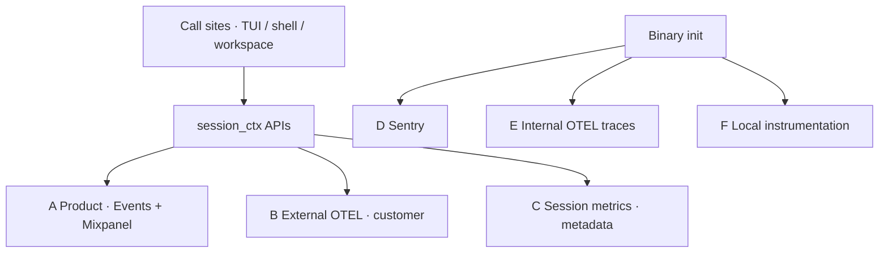
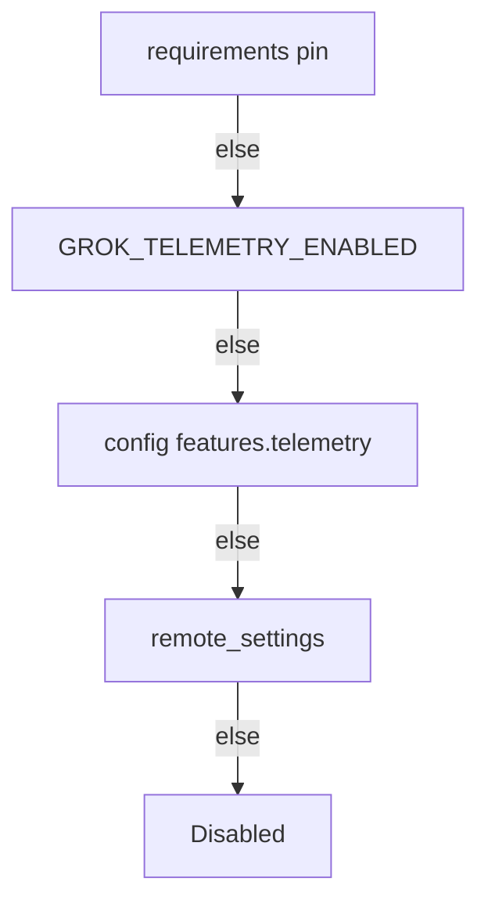
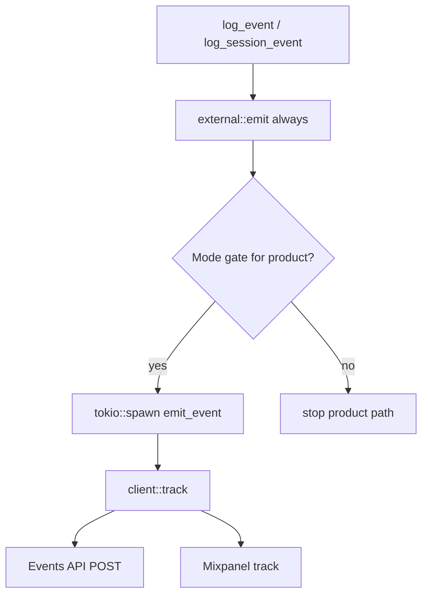

# Grok Build telemetry design

> Architecture notes for the **upstream telemetry engine** shipped in this tree
> (`xai-grok-telemetry` and its integrations). Intended for maintainers of the
> community fork (`happyfeetw/grok-cli`).
>
> For the fuller Chinese write-up (primary doc with the same diagrams), see
> **[telemetry.zh-CN.md](telemetry.zh-CN.md)**.

| Item | Value |
|------|--------|
| Core crate | [`crates/codegen/xai-grok-telemetry`](../crates/codegen/xai-grok-telemetry) |
| Mixpanel client | [`crates/codegen/xai-mixpanel`](../crates/codegen/xai-mixpanel) |
| Config / gates | `xai-grok-shell` (`agent/config`, `agent/init`, `auth`) |
| Process wiring | `xai-grok-pager-bin` / `xai-grok-pager` |

---

## Goals

1. **Product analytics** (xAI): feature usage and funnels → Events API + Mixpanel.
2. **Customer observability**: opt-in external OTEL to the **customer’s** collector.
3. **Reliability**: Sentry for crashes/errors.
4. **Internal traces**: session spans → official OTLP / cli-chat-proxy (authenticated).
5. **Local debug**: unified logs, Chrome traces, subsystem logs.

Cross-cutting rules: product analytics **default off**; typed events; one call site /
multiple sinks with **independent gates**; layered privacy (ZDR, opt-out, schema
allowlists, redaction, managed requirements).

---

## Channel map



| ID | Channel | Default | Primary gate | Destination |
|----|---------|---------|--------------|-------------|
| A | Product events + Mixpanel | Off | `TelemetryMode::Enabled` (+ not ZDR team in shell) | xAI / Mixpanel |
| B | External OTEL | Off | `GROK_EXTERNAL_OTEL` **and** exporter double opt-in | Customer collector |
| C | Session metrics | Off | `Enabled` or `SessionMetrics` | Same wire as A, thinner payloads |
| D | Sentry | Needs DSN | `SENTRY_DSN` | Sentry |
| E | Internal OTEL traces | As wired | Auth + internal endpoint | cli-chat-proxy |
| F | Local debug | Env | `GROK_INSTRUMENTATION` etc. | Disk / stderr |

**B is independent of A.** Turning off product analytics does not disable a
customer’s own OTEL stream.

---

## TelemetryMode

```text
Disabled        → no client; nothing product-side
SessionMetrics  → lifecycle metadata only (log_session_event)
Enabled         → full product analytics (log_event + session events)
```

### Resolution order



### ZDR / data collection

- `is_zdr_team()` — product analytics and user-facing sync style gates.
- `is_data_collection_disabled()` — ZDR **or** coding-data-retention opt-out
  (trace upload, research-style collection, heap profiles).
- `product_analytics_enabled()` — `Mode::Enabled && !ZDR`.

---

## Emission path



Wire names:

- `event_name`: `grok-shell-<suffix>` or `grok-workspace-<suffix>`
- `event_value`: bare `<suffix>` after stripping the origin prefix

Identity stamped on every product event: `agent_id`, optional `user_id` /
`team_id` / `deployment_id`, `shell_version`, client type/version,
normalized `subscription_tier`.

Open-source defaults: `internal_defaults()` leave Events URL, API key, and
Mixpanel token **empty** — nothing is sent until configured.

---

## External OTEL (channel B)

Double opt-in: master switch **and** a real metrics/logs exporter.

Invariants:

- Never installs into `opentelemetry::global`.
- No internal auth headers.
- Closed schema (`ExternalEventName`, `ExternalKey`); content gates only tighten.
- Remote policy can force-disable, not force-enable.
- Refuses activation if the internal pipeline already consumed
  `OTEL_EXPORTER_OTLP_*` (no double-send).

---

## Init sequence (summary)

1. Binary: `external::init`, optional `sentry::init`, tracing layers.
2. Shell `INIT`: resolve mode / trace_upload → `client::init` with identity + shared HTTP client.
3. After auth: `update_telemetry_config` / `init_if_needed` to attach user/team.

---

## Source map

| Path | Role |
|------|------|
| `client.rs` | Global client, `track`, dual sink |
| `config.rs` | Mode + config + env |
| `session_ctx.rs` | Task-local context + public APIs |
| `events.rs` | Typed product events (~110+ names) |
| `session_metrics.rs` | Lifecycle structs |
| `external/*` | Customer OTEL |
| `sentry.rs` | Error reporting |
| `otel_layer/*` | Internal traces |
| `id.rs` | Stable `agent_id` |
| shell `resolve_telemetry_mode` | Priority resolution |
| shell `product_analytics_enabled` | Mode ∧ ¬ZDR |

---

## Fork implications

With default mode and no baked/runtime secrets, **product analytics to xAI/Mixpanel
do not fire**. The engine remains in-tree; enabling mode **and** supplying
endpoints/tokens will send data on the paths described here. Sentry depends on
DSN. External OTEL is fully customer opt-in.

See [telemetry.zh-CN.md](telemetry.zh-CN.md) for expanded diagrams, event domain
tables, payload sketches, and privacy layering.
