# Grok Build 遥测系统设计说明

> 本文描述上游开源树中 **官方设计的遥测引擎**（`xai-grok-telemetry` 及相关集成），
> 供本社区 fork（`happyfeetw/grok-cli`）维护者与贡献者理解数据流、门控与隐私边界。
>
> **不是**用户隐私政策正文；配置项的用户向说明另见 shell README 的 Telemetry 小节。

| 项 | 值 |
|----|-----|
| 主 crate | [`crates/codegen/xai-grok-telemetry`](../crates/codegen/xai-grok-telemetry) |
| Mixpanel 客户端 | [`crates/codegen/xai-mixpanel`](../crates/codegen/xai-mixpanel) |
| 配置 / 门控集成 | `xai-grok-shell`（`agent/config.rs`, `agent/init.rs`, `auth`） |
| 进程入口装配 | `xai-grok-pager-bin` / `xai-grok-pager` |
| 文档版本 | 基于仓库当前 `main` 源码梳理（2026-07） |

---

## 1. 设计目标

官方把「遥测」做成 **可独立开关的多通道系统**，而不是单一 `log → 某个 SaaS`：

1. **产品分析**（xAI 侧）：功能使用、转化漏斗、会话生命周期元数据 → Events API + Mixpanel。
2. **企业自观测**：客户把 CLI 指到 **自己的** OpenTelemetry collector（外部 OTEL 流）。
3. **可靠性**：Sentry 崩溃/错误（与产品分析正交）。
4. **内部链路观测**：会话 span 导出到官方 OTLP / cli-chat-proxy（需鉴权）。
5. **本地调试**：统一日志、Chrome trace、采样/hooks 专用 log。

横切原则：

- **默认关闭产品分析**（`TelemetryMode::Disabled`），对企业与开源构建友好。
- **类型安全事件**（struct + 编译期 `NAME`），避免字符串漂移。
- **一处调用、多 sink fan-out**，各 sink **门控独立**。
- **隐私分层**：ZDR、用户 opt-out、schema 白名单、密钥脱敏、requirements 钉死。

---

## 2. 总体架构

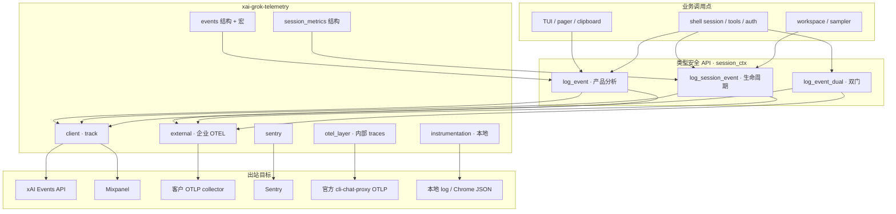

### 2.1 六条通道对照

| 代号 | 通道 | 默认 | 主门控 | 数据去向 |
|------|------|------|--------|----------|
| **A** | 产品分析 Events + Mixpanel | 关 | `TelemetryMode::Enabled` + 非 ZDR team | xAI API / Mixpanel |
| **B** | 外部 OTEL（企业） | 关 | `GROK_EXTERNAL_OTEL` **且** exporter 双 opt-in | 客户 collector |
| **C** | Session metrics | 关 | `Enabled` **或** `SessionMetrics` | 同 A 的 wire，内容更瘦 |
| **D** | Sentry | 需 DSN | `SENTRY_DSN` / 编译期 DSN | Sentry |
| **E** | 内部 OTEL traces | 随装配 | auth + 内部 endpoint | cli-chat-proxy |
| **F** | 本地调试层 | 环境变量 | `GROK_INSTRUMENTATION` 等 | 磁盘 / stderr |

**重要**：B 与 A **相互独立**——产品分析关掉时，客户仍可把数据打到自己的 OTEL；反之亦然。

---

## 3. 模式机：`TelemetryMode`

```mermaid
stateDiagram-v2
  [*] --> Disabled: 默认 / 未知字符串
  Disabled --> SessionMetrics: 配置为 session_metrics
  Disabled --> Enabled: 配置为 true / full / on
  SessionMetrics --> Enabled: 升为 full
  Enabled --> Disabled: 关 / requirements 钉死
  SessionMetrics --> Disabled: 关 / requirements 钉死

  state Disabled {
    [*] --> NoClient: client::init 清空
  }
  state SessionMetrics {
    [*] --> LifecycleOnly: log_session_event 可发
  }
  state Enabled {
    [*] --> FullProduct: log_event + log_session_event
  }
```

| 模式 | `is_enabled()` | `is_session_metrics_enabled()` | 典型用途 |
|------|----------------|--------------------------------|----------|
| `Disabled` | false | false | 企业默认、开源默认 |
| `SessionMetrics` | false | true | 仅会话/轮次元数据，无产品 content 向分析 |
| `Enabled` | true | true | 全量产品遥测 |

解析支持 bool（`true`/`false`）与字符串（`session_metrics` / `full` / `off` 等）。未知字符串 **warn 后当 Disabled**。

### 3.1 模式解析优先级

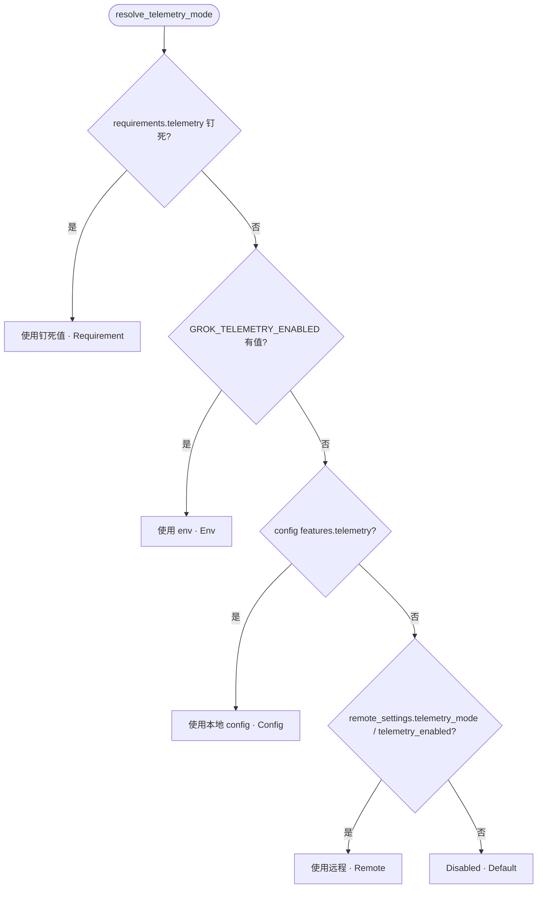

对应实现：`xai-grok-shell` → `AgentConfig::resolve_telemetry_mode`。  
client 层注释：**env > config > remote > default**（requirements 在 shell 侧最先）。

### 3.2 与 ZDR / 数据收集的关系

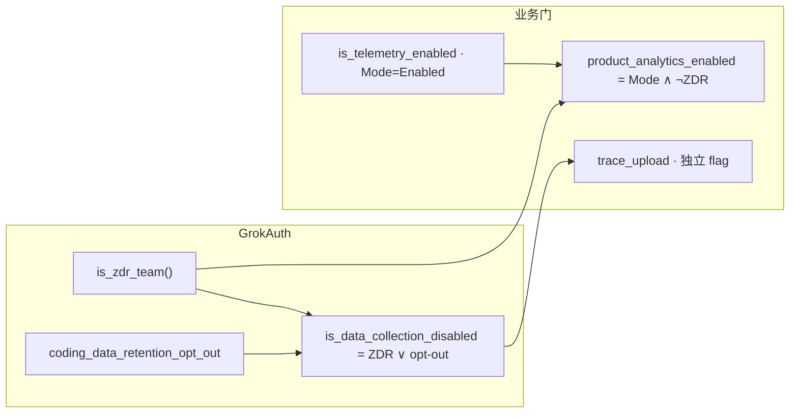

| API | 用途 |
|-----|------|
| `is_zdr_team()` | 产品分析、面向用户的 sync 等 |
| `is_data_collection_disabled()` | trace 上传、研究数据、heap profile 等 |
| `product_analytics_enabled()` | shell 会话内产品分析（Mode + 非 ZDR） |

注释约定：**产品分析看 ZDR**；**更广的数据收集看 ZDR ∨ opt-out**。

---

## 4. 类型安全事件模型

### 4.1 宏与 trait

```text
telemetry_event!(StructName, "wire_suffix");
telemetry_event!(StructName, "wire_suffix", external = mapper_fn);
```

- `TelemetryEvent::NAME`：wire 上的 **后缀**（再加 `grok-shell-` / `grok-workspace-` 前缀）。
- `external_record()`：可选映射到企业 OTEL 封闭 schema；默认 `None`（不进外部流）。
- 字段优先用 **serde `snake_case` 枚举**（`PermissionOutcome`、`CompactionTrigger`…），保证仪表盘维度稳定。

### 4.2 Emitter 来源

| `EmitterOrigin` | 前缀 | 典型进程 |
|-----------------|------|----------|
| `Shell` | `grok-shell-` | TUI / pager / 本地 agent |
| `Workspace` | `grok-workspace-` | 远程 workspace / sampler |

`client::track` 会把前缀剥掉得到 `event_value`（如 `grok-shell-turn` → `turn`），便于跨 surface 聚合。

### 4.3 事件域分类（产品侧）

下列为按业务域归纳（完整绑定见 `events.rs`，约 **110+** 个 `NAME`）：

| 域 | 代表 `NAME` |
|----|-------------|
| 登录 / 鉴权 | `login`, `login_*`, `manual_auth`, `api_key_save_result` |
| 权限 / 工具 | `permission_prompted`, `permission_decision`, `tool_call_completed`, hooks |
| 会话 / 轮次 | `session_started`, `session_*`, `turn`, `turn_completed*` |
| 压缩 | `compaction_triggered`, `compaction_completed`, `auto_compact_*` |
| 插件 / 技能 / MCP | `plugin_*`, `skill_*`, `mcp_*` |
| UI / 终端 | `clipboard_*`, `dashboard_*`, `terminal_context`, `contextual_tip` |
| 商业化 | `supergrok_upsell_*`, `credit_limit_*`, `subscription_activated` |
| 反馈 / 仓库 | `user_feedback`, `pr_created`, `repo_changes` |
| Trace 上传 | `trace_upload_attempted/succeeded/failed/skipped` |
| 外部 OTEL 元 | `external_otel_configured`, `external_otel_export_health` |
| Memory 子系统 | `memory_session_init`, `memory_search`, `memory_flush_*` |

### 4.4 企业外部 OTEL 事件名（封闭集）

Schema v1，scope `ai.xai.grok_code`：

| 逻辑名 | Wire `event.name` |
|--------|-------------------|
| SessionStart | `grok_code.session_start` |
| SessionEnd | `grok_code.session_end` |
| UserPrompt | `grok_code.user_prompt` |
| TurnCompleted | `grok_code.turn_completed` |
| ApiRequest / ApiError | `grok_code.api_request` / `api_error` |
| ToolResult / ToolDecision | `grok_code.tool_result` / `tool_decision` |
| McpServerConnection | `grok_code.mcp_server_connection` |
| PermissionModeChanged | `grok_code.permission_mode_changed` |
| SkillActivated / PluginLoaded | `…` |
| Compaction / Subagent / Auth | `…` |
| InternalError / ModelSwitched / ContextualTip | `…` |

属性键为 `ExternalKey` **枚举白名单**（`session.id`、`user.id`、`model`…）；默认不落 prompt/tool 正文，content gate 仅可 **收紧**。

---

## 5. 发射路径（核心逻辑）

### 5.1 会话上下文

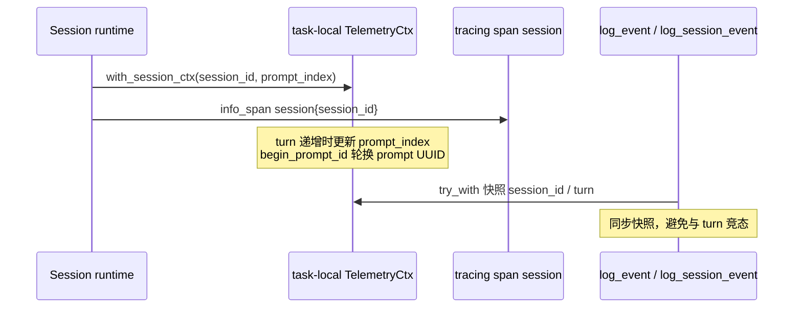

- `TelemetryCtx`：`session_id`、`prompt_index`（`Mutex<usize>`）、`prompt_id`（每轮 UUID，主要服务外部 OTEL）。
- `session_id` 字段名与 debug firehose 路由 **硬绑定**（常量 `SESSION_ID_FIELD`）。

### 5.2 `log_event` / `log_session_event` 决策树

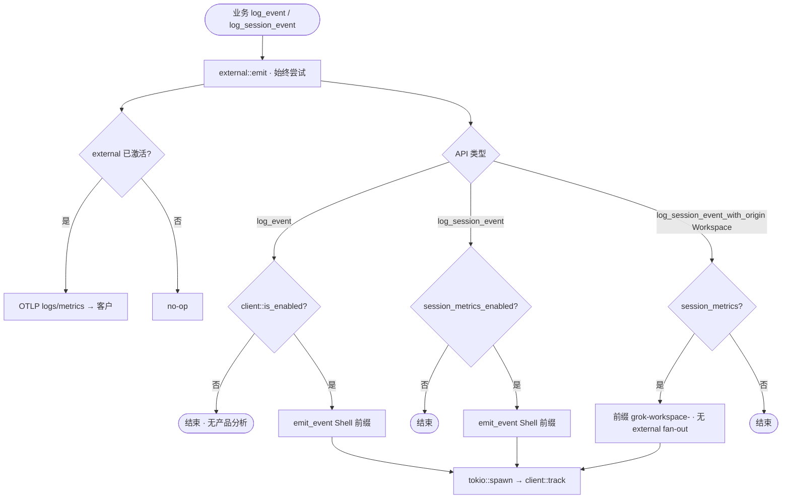

`log_event_dual(internal_enabled, data)`：

- `internal_enabled == true` → 走 `log_event`（双 sink，各计一次）。
- `false` → **只** `external::emit`，避免 ZDR 路径下内部仍记账、又不会重复 `session.count`。

### 5.3 `emit_event` → `client::track` 载荷

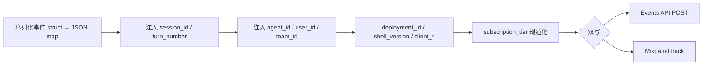

**Events API 请求体形状（概念）：**

```json
{
  "viewer_context": {
    "request_id": "<event_name>-<uuid>",
    "user_attributes": {
      "user_id": "...",
      "user_type": "LoggedIn",
      "country": "...",
      "language": "..."
    },
    "device_attributes": { "app_name": "Grok Code" }
  },
  "api_key": "<events_api_key>",
  "events": [{
    "event_name": "grok-shell-<suffix>",
    "event_value": "<suffix>",
    "event_metadata": { "...": "..." },
    "timestamp": "<RFC3339>"
  }]
}
```

- HTTP：`POST events_url`，头 `x-api-key`，超时 10s；失败 **吞掉**（不阻断主路径）。
- Mixpanel：`POST https://api.mixpanel.com/track`（base64 form）；属性先 **`redact_json_string_values`** 再注入 `token`；`$insert_id` 防重。
- `sync_profile()`：init 时 `engage` 写用户 profile（fire-and-forget）。

### 5.4 `subscription_tier` 规范化

展示名与 JWT claim 统一为 snake_case，例如：

| 输入 | 输出 |
|------|------|
| `Free` / `free` | `free` |
| `SuperGrok Heavy` | `supergrok_heavy` |
| `API Key` | `api_key`（**单独分段，不当 free**） |

---

## 6. 配置与密钥

### 6.1 `TelemetryConfig` 字段

| 字段 | 含义 |
|------|------|
| `events_url` / `events_api_key` | 产品 Events API |
| `mixpanel_token` / `mixpanel_enabled` | Mixpanel |
| `trace_upload` | 会话工件上传开关（可与 mode 解耦） |
| `otel_enabled` / `otel_*` | 外部 OTEL 配置面（与 env 叠加） |

### 6.2 密钥分层

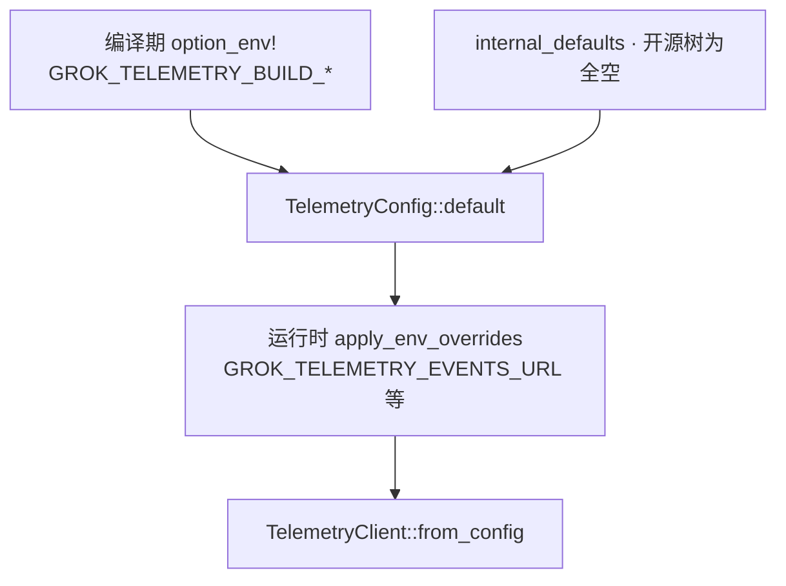

公开源码树中 `internal_defaults()` 为 **(None, None, None, false)**：  
**未烘焙密钥时默认不启用 Mixpanel / Events**，除非用户或 CI 显式配置。

### 6.3 常用环境变量

| 变量 | 作用 |
|------|------|
| `GROK_TELEMETRY_ENABLED` | mode：`true` / `false` / `session_metrics` / … |
| `GROK_TELEMETRY_EVENTS_URL` / `_API_KEY` | Events 目的地 |
| `GROK_TELEMETRY_MIXPANEL_TOKEN` / `_ENABLED` | Mixpanel |
| `GROK_TELEMETRY_TRACE_UPLOAD` | trace 上传 |
| `GROK_EXTERNAL_OTEL` | 企业 OTEL 主开关 |
| `OTEL_METRICS_EXPORTER` / `OTEL_LOGS_EXPORTER` | `otlp` / `console` / `none` |
| `OTEL_EXPORTER_OTLP_*` | 标准 OTLP endpoint / headers |
| `SENTRY_DSN` | Sentry |
| `GROK_INSTRUMENTATION` | 本地 instrumentation 模式 |
| `GROK_TELEMETRY_SPECIAL_USER` | 特殊用户 opt-in 调试门 |

---

## 7. 初始化时序

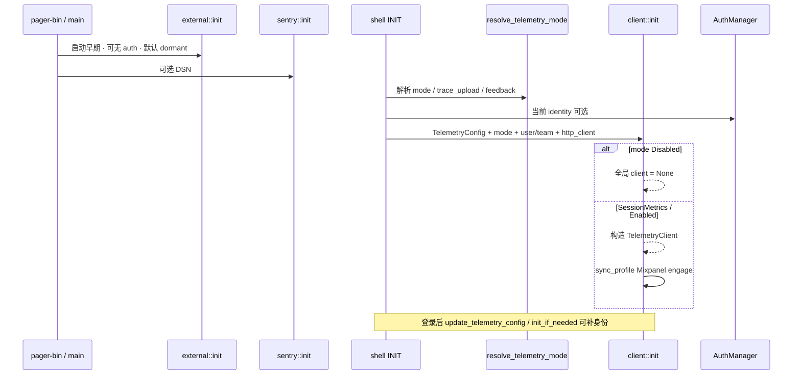

要点：

- **HTTP 客户端**复用 shell `shared_client()`（TLS 池、UA），遥测不另起栈。
- `init` 可重复调用：Disabled 时拆掉 client；`init_if_needed` 仅在尚无 client 时创建。
- 外部 OTEL **先于 auth** 初始化；身份属性可在登录后更新。

---

## 8. 通道 B：外部 OTEL 细节

### 8.1 双重 opt-in

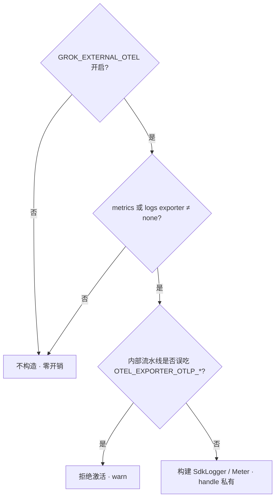

### 8.2 结构性不变量

1. **从不**注册到 `opentelemetry::global`（避免与内部 tracer 抢占）。
2. **不依赖** `AuthCredentialProvider`，不会挂内部 token。
3. 与 `TelemetryMode` / GCS trace upload / 用户 data-retention opt-out **解耦**（数据去向是客户自己的系统）。
4. Remote policy **只能收紧**（`force_disable`、`lock_content_gates`），**不能远程打开**。
5. 进程内 `event.sequence` 单调；`prompt.id` 仅挂在 events，不挂 metrics（可配置是否在 metrics 上挂 session/version）。

---

## 9. 其他通道摘要

### 9.1 Sentry（D）

- `send_default_pii: false`，traces 采样约 **1%**。
- `before_send`：密钥脱敏、home 路径替换、username 段擦除。
- Scope tags：`client`、`client_version`、`os`、`arch`。
- 退出路径 `flush_on_shutdown`。

### 9.2 内部 OTEL traces（E）

- 模块：`otel_layer`。
- 导出到官方 traces URL；批处理时读 **活的** bearer（`AuthCredentialProvider`）。
- Resource：`client.name`、`client.version`、`service.version`、`app.entrypoint`。
- 与外部流 **路径隔离**；若内部误用了标准 `OTEL_EXPORTER_OTLP_*` 会阻塞外部流激活。

### 9.3 本地调试（F）

| 模块 | 用途 |
|------|------|
| `instrumentation` | Log / Chrome / Server 模式 |
| `unified_log` | 统一结构化日志 |
| `debug_log` | 按 session 路由 firehose |
| `sampling_log` / `hooks_log` / `memory_log` | 子系统专用 |

### 9.4 Trace 上传生命周期（与 A 可解耦）

`TraceUploadReason`：`zdr_team` / `feature_off` / `no_credentials` / `proxy` / `direct_s3` / `direct_gcs` / …  
可出现「telemetry 关、trace 开」：仅上传会话工件，不发产品分析事件。

---

## 10. 身份模型

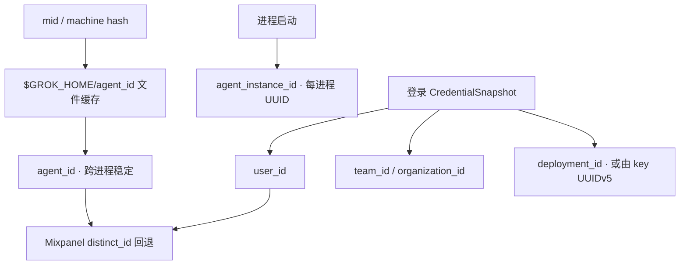

- macOS 上 `mid::get` 可能很慢 → **文件缓存**避免每次启动 1–3s。
- Linux 容器：`machine-id` 可能共享，混入 `HOSTNAME` 再哈希。

---

## 11. 模块地图（源码导航）

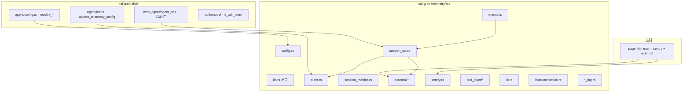

| 路径 | 职责 |
|------|------|
| `client.rs` | 全局 `OnceLock` client、`track`、双写、profile |
| `config.rs` | Mode / Config / env / deployment_id |
| `session_ctx.rs` | 任务本地上下文、公开 emit API |
| `events.rs` | 产品事件类型与宏绑定 |
| `session_metrics.rs` | 生命周期结构体 |
| `external/` | 企业 OTEL：config / emit / schema / redact |
| `sentry.rs` | 错误上报 |
| `otel_layer/` | 内部 span 导出 |
| `id.rs` | agent_id / instance_id |
| `xai-mixpanel` | 轻量 track/engage HTTP |

---

## 12. 隐私与合规视角（实现层）

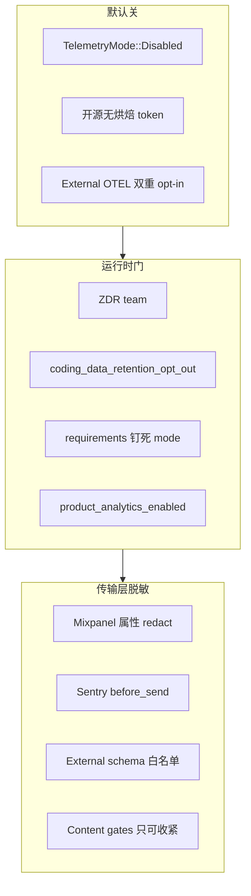

**对本 fork 发行物的实际含义：**

1. 未配置 endpoint/token、mode 保持默认时：**不会**向 xAI Events / Mixpanel 主动上报产品分析。
2. 用户或远程若打开 mode **并**提供密钥，仍按本文路径发送（fork 未删除引擎）。
3. Sentry 取决于是否存在 `SENTRY_DSN`。
4. 企业外部 OTEL 完全由客户显式配置。

---

## 13. 与 trace upload 的边界

| 能力 | 是否依赖 `TelemetryMode::Enabled` | 备注 |
|------|-----------------------------------|------|
| `log_event` 产品分析 | 是 | 且 shell 常叠加 ¬ZDR |
| `log_session_event` | `Enabled` 或 `SessionMetrics` | |
| Trace 工件上传 | 默认随 Enabled，可 env/config 单独关开 | 可「关分析、开上传」 |
| External OTEL | 否 | 客户 collector |
| Sentry | 否 | DSN |

---

## 14. 附录：阅读顺序建议

1. `config.rs` — Mode 语义  
2. `session_ctx.rs` — 调用约定  
3. `client.rs` — wire 与双写  
4. `events.rs` 前半枚举 + 末尾 `telemetry_event!` 列表  
5. `external/mod.rs` + `schema.rs` — 企业流  
6. shell `resolve_telemetry_mode` + `product_analytics_enabled` — 产品门  
7. pager-bin `main` — 进程级装配  

---

## 15. 修订记录

| 日期 | 说明 |
|------|------|
| 2026-07-17 | 初版：基于源码梳理官方遥测设计，供 fork 文档使用 |
